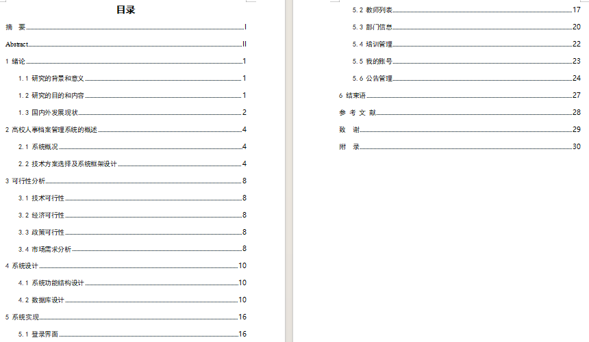
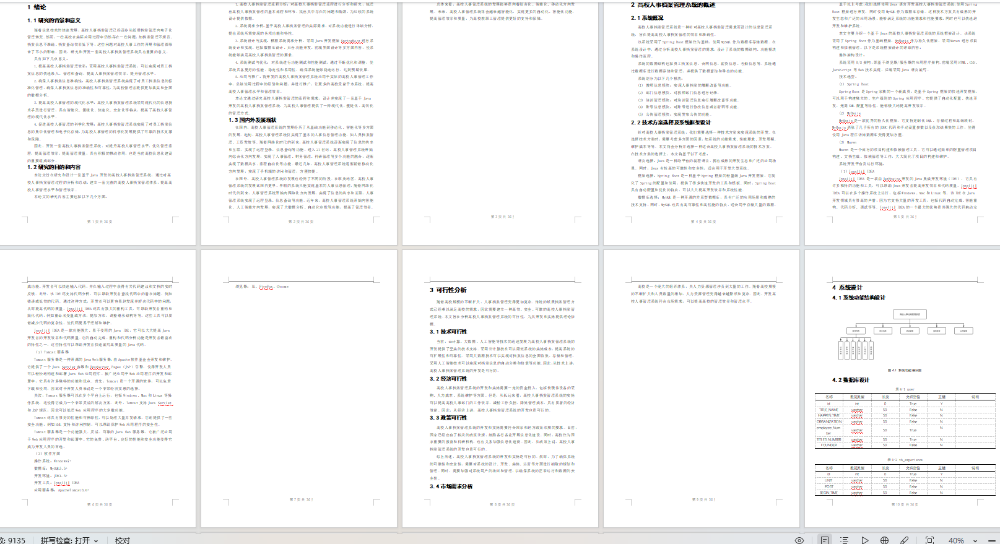
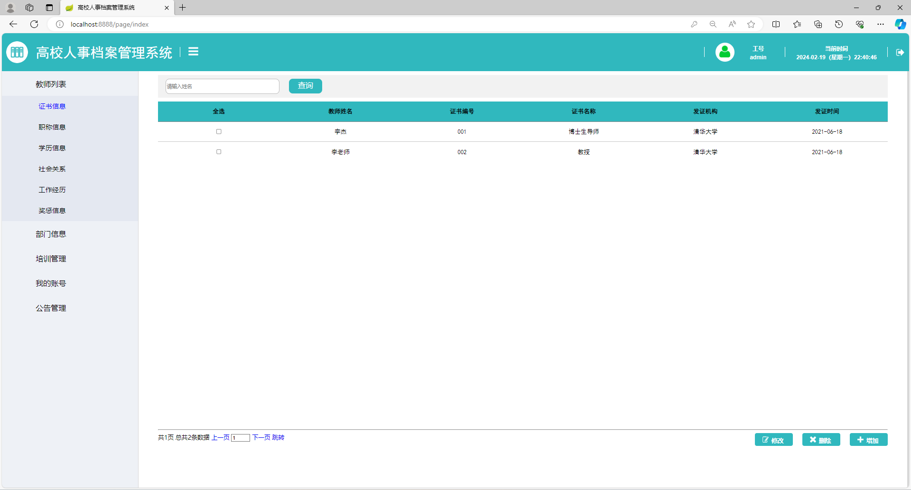
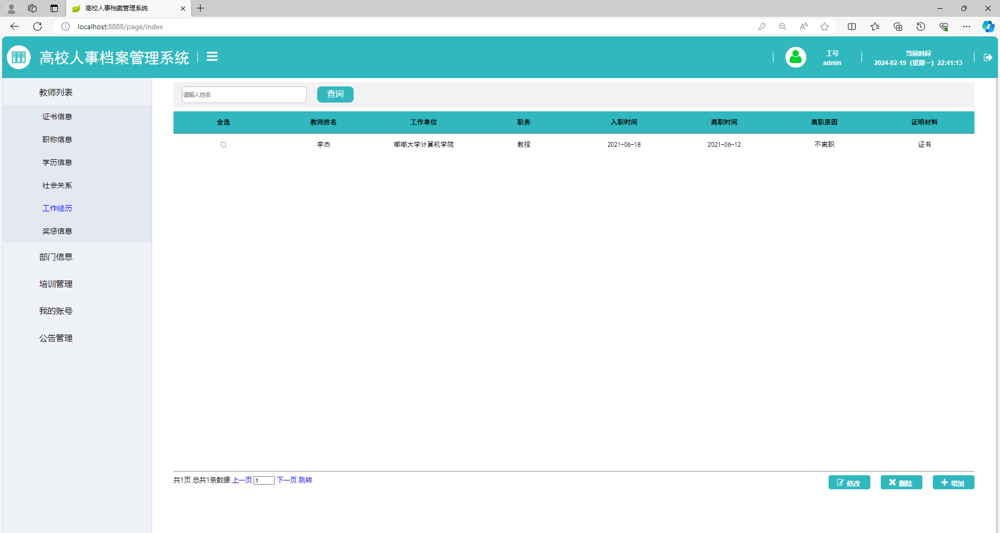
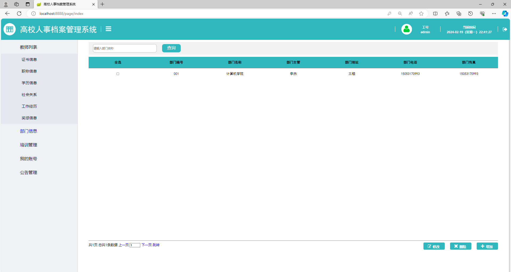

# 人事档案管理系统带9000字文档

### 9.9￥ 获取完整源码+sql，附赠9000字论文参考，需要加Q：3808981644  或者加微信 ：qszard26
### 有问题，或者需要协助调试运行项目的也可联系
### 获取更多项目，关注公众号：编程项目集

## 一、项目介绍

开发语言：java

运行环境:idea或eclipse 数据库:mysql

系统角色:管理员 教师

主要技术:Java,Springboot,mybatis,mysql,jquery、jsp、ajax

教师列表、证书信息、职称信息、学历信息、社会关系、工作经历、奖惩信息、部门信息、培训管理、我的账号、公告管理

## 二、9000字论文参考

## 三、部分功能界面展示

### 9.9￥ 获取完整源码+sql，附赠9000字论文参考，需要加Q：3808981644  或者加微信 ：qszard26
### 有问题，或者需要协助调试运行项目的也可联系

