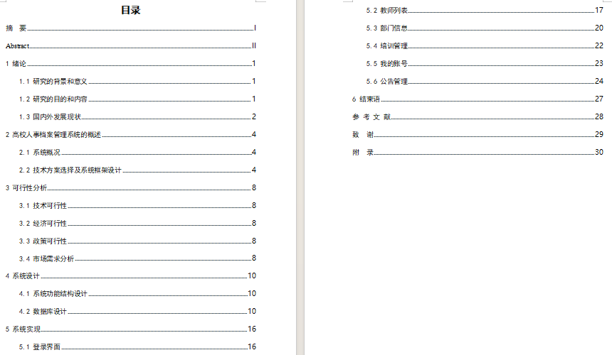
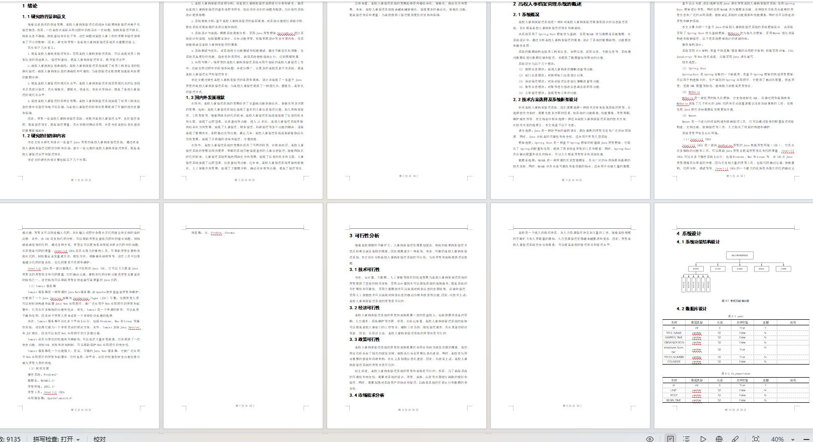
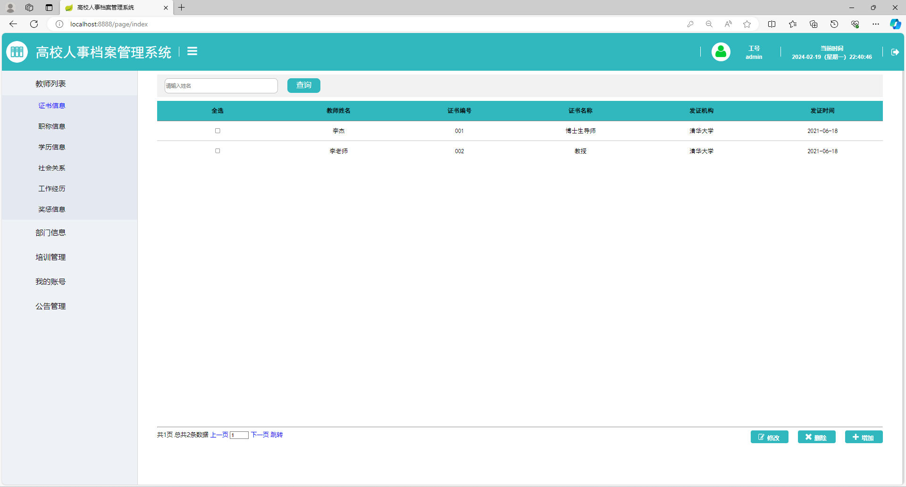
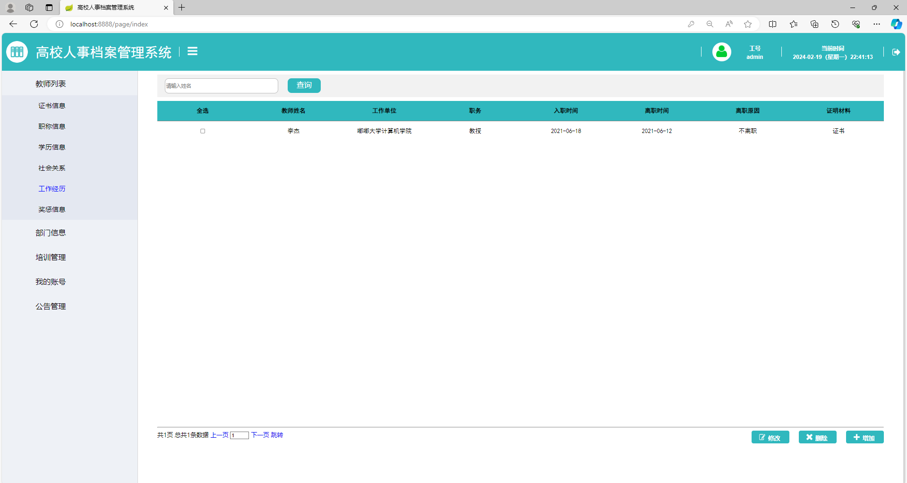
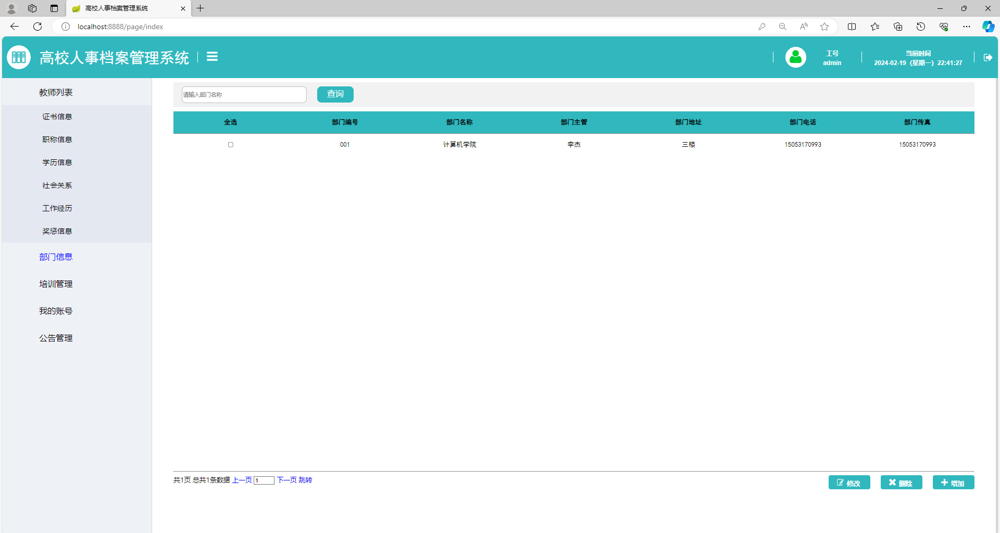

# 人事档案管理系统带9000字文档

### 完整项目获取

通过网盘分享的文件：人事档案管理系统

链接: https://pan.baidu.com/s/1LPUk1curQwU0EmwSrEjgfw?pwd=ch2r 提取码: ch2r --来自百度网盘超级会员v3的分享

通过网盘分享的文件：工具包

链接: https://pan.baidu.com/s/1YmdoJvkjoUjA75wvHLDZ6A?pwd=xm96 提取码: xm96
--来自百度网盘超级会员v3的分享

需要远程项目部署或项目修改和毕业设计也可联系（添加申请时请备注好来意）

通过网盘分享的文件：远程调试部署联系方式

链接: https://pan.baidu.com/s/1W0dDcoZmayG0c7USJDYBYg?pwd=nqd7 提取码: nqd7
--来自百度网盘超级会员v3的分享

### 项目合集(项目不断更新中)
链接: https://pan.baidu.com/s/1nY-zhvAK0CXYcn3g7LzQnQ?pwd=id3c 提取码: id3c
--来自百度网盘超级会员v3的分享

#### 这些项目一起发你了 可以分享给你需要的同学 调试可找我 也接二次修改和项目定制、毕业设计等

## 接毕业设计和论文

微信联系方式：xzxj0206  QQ：3808981644   (支持修改、 部署调试、 支持代做毕设)

接网站建设、小程序、H5、APP、各种系统等，单片机、嵌入式也可以做

选题+开题报告+任务书+程序定制+安装调试+论文+答辩ppt  都可以做

## 一、项目介绍

开发语言：java

运行环境:idea或eclipse 数据库:mysql

系统角色:管理员 教师

主要技术:Java,Springboot,mybatis,mysql,jquery、jsp、ajax

教师列表、证书信息、职称信息、学历信息、社会关系、工作经历、奖惩信息、部门信息、培训管理、我的账号、公告管理

## 二、9000字论文参考

## 三、部分功能界面展示

